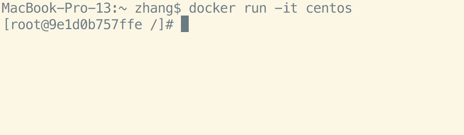

# Docker上运行CentOS
先拉取CentOS的镜像
`docker pull centos`

如遇到速度比较慢的情况可用[**DaoCloud加速器**](https://www.daocloud.io/mirror#accelerator-doc)

然后基于CentOS的镜像创建一个容器
`docker run -it centos`

修改root的密码
`passwd root`

Ctrl+D退出，然后提交本次对容器的更改，生成新的镜像
`docker commit 9e1d0b757ffe mycentos:latest`

然后接着运行生成的新的镜像mycentos:latest
`docker run --cap-add=SYS_ADMIN -ti -e  "container=docker" -v /sys/fs/cgroup:/sys/fs/cgroup mycentos:latest  /usr/sbin/init`

输入用户root，输入通过passwd root修改的密码

